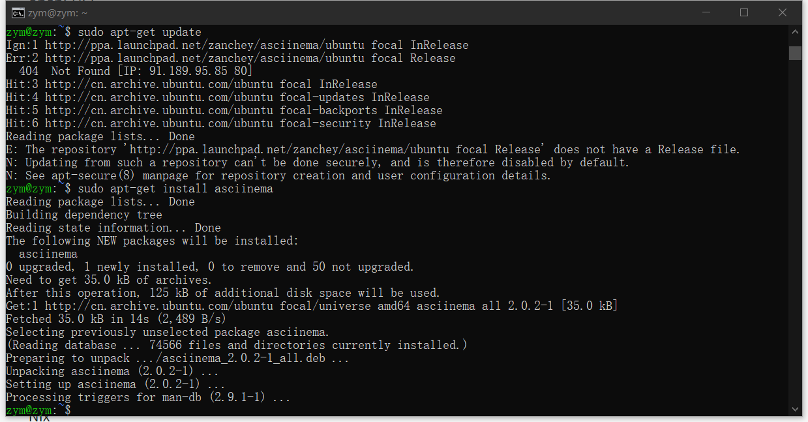
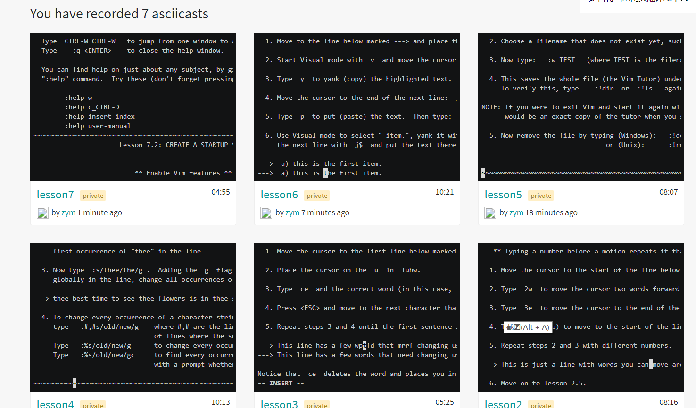

# Linux服务器系统使用基础
## 软件环境
- 当前课程推荐的 Linux 发行版本√    Ubuntu20.04
- 在asciinema注册一个账号，并在本地安装配置好asciinema
在Ubuntu中安装asciinema，按照官方指南安装
```
sudo apt-add-repository ppa:zanchey/asciinema
sudo apt-get update
sudo apt-get install asciinema
```

- 确保本地已经完成asciinema auth，并在asciinema成功关联了本地账号和在线账号

- 上传本人亲自动手完成的vimtutor操作全程录像
- 在自己的github仓库上新建markdown格式纯文本文件附上asciinema的分享URL
    1. lesson1  https://asciinema.org/a/7MyuQfd4LzHsbu3WUbYhPEz9e
    2. lesson2  https://asciinema.org/a/kXO28kGfByOKTgsyIEAcszCqe
    3. lesson3  https://asciinema.org/a/BvopClqTXT7qUI0gDOkIOaCPA
    4. lesson4  https://asciinema.org/a/aRNw7sKPhswdFEY7Ftmxw8cip
    5. lesson5  https://asciinema.org/a/yMPYSZ1UMEW8iEpGslRqQ0jSp
    6. lesson6  https://asciinema.org/a/fAi1RZhFh4hWwMf5J5EmmZBkx
    7. lesson7  https://asciinema.org/a/unwBa11sCz0umvuS5tXIrnbjX
- 提醒 避免在终端操作录像过程中暴漏密码、个人隐私等任何机密数据

## vimtutor完成后的自查清单
- 你了解vim有哪几种工作模式？
    - normal模式；编辑模式；命令模式；可视化模式
- Normal模式下，从当前行开始，一次向下移动光标10行的操作方法？如何快速移动到文件开始行和结束行？如何快速跳转到文件中的第N行？
    - 向下移动10行输入10j。快速移动到文件开始行输入gg。结束行输入G。快速跳转到文件中的第N行输入nG
- Normal模式下，如何删除单个字符、单个单词、从当前光标位置一直删除到行尾、单行、当前行开始向下数N行？
    - 在正常(Normal)模式下，可以按下 x 键来删除光标所在位置的字符。输入 dw 可以从光标处删除至一个单词的末尾。输入 d$ 从当前光标删除到行末。输入 dd 可以删除整一个当前行。删除n行输入ndd
- 如何在vim中快速插入N个空行？如何在vim中快速输入80个-？
    - 输入 o 将在光标的下方打开新的一行并进入插入模式。
- 如何撤销最近一次编辑操作？如何重做最近一次被撤销的操作？
    - 输入 u 来撤消最后执行的命令，输入 U 来撤消对整行的修改。多次输入 CTRL-R (先按下 CTRL 键不放开，接着按 R 键)，这样就可以重做被撤消的命令，也就是撤消掉撤消命令。
- vim中如何实现剪切粘贴单个字符？单个单词？单行？如何实现相似的复制粘贴操作呢？
    - 使用操作符 y 复制文本，使用 p 粘贴文本。yw 可以用来复制一个单词
- 为了编辑一段文本你能想到哪几种操作方式（按键序列）？
    - 在正常(Normal)模式下，可以按下 x 键来删除光标所在位置的字符。可以按下 i 键来插入文本。按 A 键以添加文本。输入 p 将最后一次删除的内容置入光标之后。输入 r 和一个字符替换光标所在位置的字符。要改变文本直到一个单词的末尾，请输入 ce。
- 查看当前正在编辑的文件名的方法？查看当前光标所在行的行号的方法？
    - CTRL-G
- 在文件中进行关键词搜索你会哪些方法？如何设置忽略大小写的情况下进行匹配搜索？如何将匹配的搜索结果进行高亮显示？如何对匹配到的关键词进行批量替换？
    - 输入 / 加上一个字符串可以用以在当前文件中查找该字符串。设置忽略大小写的情况 :set ic。匹配的搜索结果进行高亮显示 :set hls is。输入 :%s/old/new/g则是替换整个文件中的每个匹配串，替换 old 为 new
- 在文件中最近编辑过的位置来回快速跳转的方法？
    - 输入 u 来撤消最后执行的命令，输入 U 来撤消对整行的修改
- 如何把光标定位到各种括号的匹配项？例如：找到(, [, or {对应匹配的),], or }
    - 输入 % 可以查找配对的括号 )、]、}。
- 在不退出vim的情况下执行一个外部程序的方法？
    - 输入 :! 然后紧接着输入一个外部命令可以执行该外部命令。
- 如何使用vim的内置帮助系统来查询一个内置默认快捷键的使用方法？如何在两个不同的分屏窗口中移动光标？
    - 输入 :help 或者按 F1键或 Help键可以打开帮助窗口。输入 CTRL-W CTRL-W   可以使您在窗口之间跳转。
## 参考文件
VIM自带的vimtutor中文版 - 哔哩哔哩 https://www.bilibili.com/read/cv327488/