赵雨萌 信安2班 2019302120123
## 无人值守Linux安装镜像制作
# 软件环境
Ubuntu 20.04 Server 64bit

# 实验问题
- Virtualbox安装完Ubuntu之后新添加的网卡如何实现系统开机自动启用和自动获取IP？  
所有网卡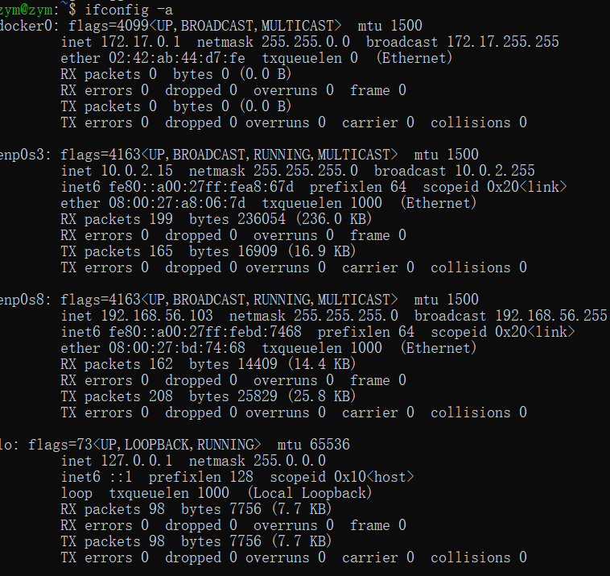
参考资料：(3条消息) ubuntu20添加新网卡后设置自动启用并获取ip_lalala-CSDN博客 https://blog.csdn.net/xiongyangg/article/details/110206220
- 如何使用sftp在虚拟机和宿主机之间传输文件？
```
# 连接远程服务器
sftp root@192.168.25.140
# 上传文件
put 当前路径  远程连接
# 下载文件
get 远程路径  当前路径
```
参考资料：Linux sftp命令详解 - 小a玖拾柒 - 博客园 https://www.cnblogs.com/ftl1012/p/sftp.html
# 查看虚拟机IP地址
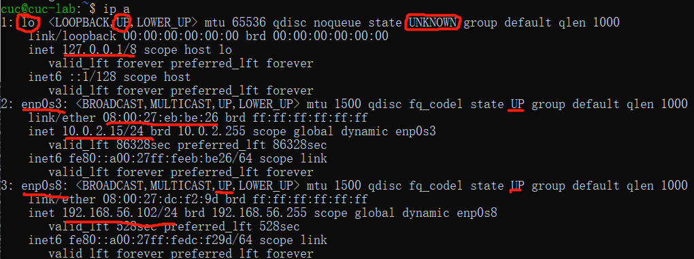
# Focal Fossa 无人值守安装 iso 
- 定制安装 OpenSSH Server   
```
sudo apt-get install openssh-server 
```
操作步骤：
- 提前下载好纯净版 Ubuntu 安装镜像 iso 文件
- 手动安装 Ubuntu 后得到的一个初始「自动配置描述文件」
    - 新建虚拟机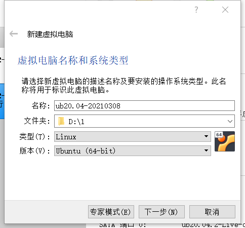    
    - 直到分配内存大小以前均为默认设置
    - 虚拟硬盘大小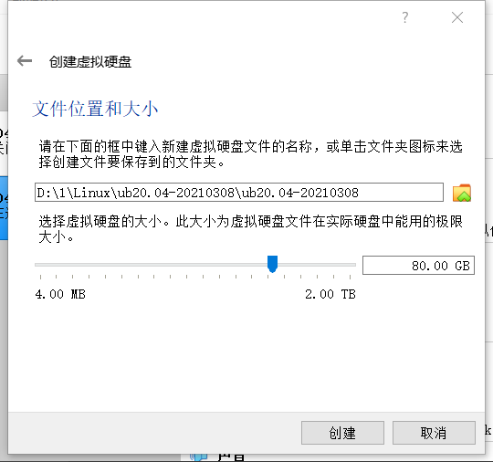
    - 创建双网卡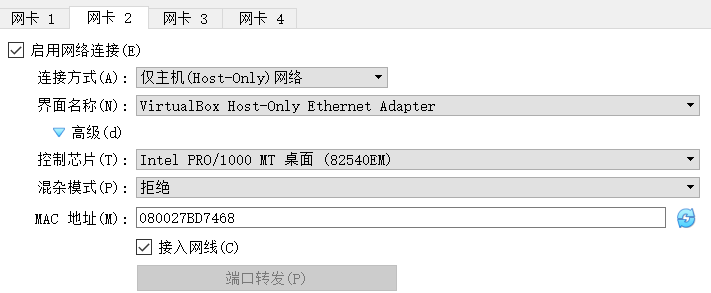
    - 选择虚拟硬盘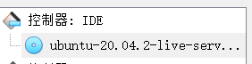
    - 启动镜像，设置默认选项
    - 确认摧毁虚拟机硬盘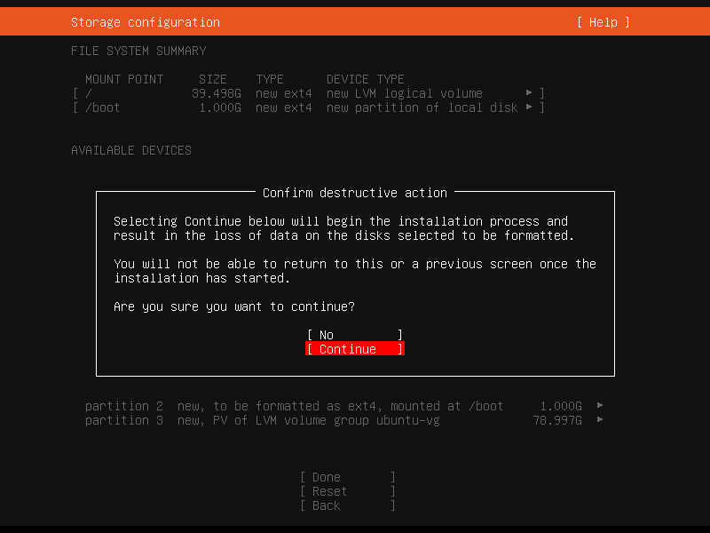
    - 设置用户名密码。。
    - install openssh server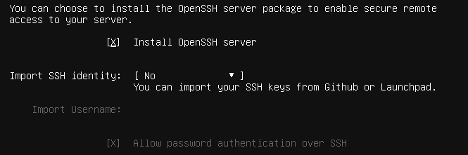
    - 安装成功
    - 得到初始文件（按老师给的比对修改）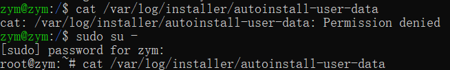
    ```
    #cloud-config
    autoinstall:
    apt:
    geoip: true
    preserve_sources_list: false
    primary:
    - arches: [amd64, i386]
      uri: http://cn.archive.ubuntu.com/ubuntu
    - arches: [default]
      uri: http://ports.ubuntu.com/ubuntu-ports
    identity: {hostname: zym, password: $6$hGpMWlvjxvePtnNk$4qxFFeIq/jFIOWiiUBTMMKJ4lbQzTzlruzx0YB98eBeVo5DIqeCjbFJxxAjQiaHyeGBmzmLFqScvAANgVszMU0,
    realname: zhaoyumeng, username: zym}
    keyboard: {layout: us, toggle: null, variant: ''}
    timezone:Asia/Shanghai
    locale: en_US.UTF-8
    network:
    ethernets:
      enp0s3: {dhcp4: true}
      enp0s8: {dhcp4: true}
    version: 2
    ssh:
    allow-pw: true
    authorized-keys: []
    install-server: true
    storage:
    config:
    - {ptable: gpt, path: /dev/sda, wipe: superblock,
      preserve: false, name: '', grub_device: true, type: disk, id: disk-sda}
    - {device: disk-sda, size: 1MB, flag: bios_grub, number: 1, preserve: false,
      grub_device: false, type: partition, id: partition-0}
    - {device: disk-sda, size: 1GB, wipe: superblock, flag: '', number: 2,
      preserve: false, grub_device: false, type: partition, id: partition-1}
    - {fstype: ext4, volume: partition-1, preserve: false, type: format, id: format-0}
    - {device: disk-sda, size: -1, wipe: superblock, flag: '', number: 3,
      preserve: false, grub_device: false, type: partition, id: partition-2}
    - name: ubuntu-vg
      devices: [partition-2]
      preserve: false
      type: lvm_volgroup
      id: lvm_volgroup-0
    - {name: ubuntu-lv, volgroup: lvm_volgroup-0, size: -1, preserve: false,
      type: lvm_partition, id: lvm_partition-0}
    - {fstype: ext4, volume: lvm_partition-0, preserve: false, type: format, id: format-1}
    - {device: format-1, path: /, type: mount, id: mount-1}
    - {device: format-0, path: /boot, type: mount, id: mount-0}
    version: 1
    ```
    - 下载autoinstall-user-data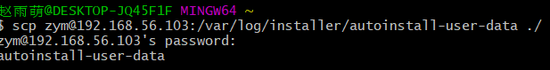
- 制作包含 user-data 和 meta-data 的 ISO 镜像文件
```
 sudo apt install docker.io
 sudo apt  install docker-compose
```
最终用Ultra ISO制作镜像
- 移除新建虚拟机「设置」-「存储」-「控制器：IDE」
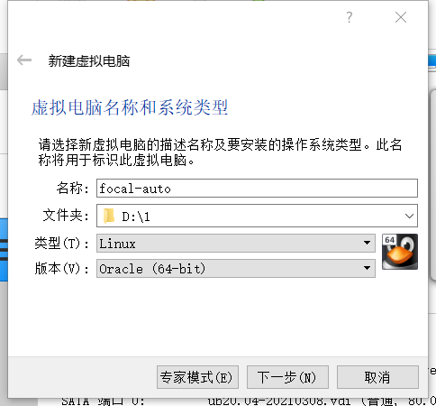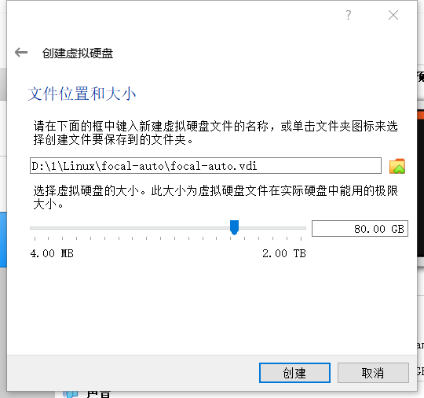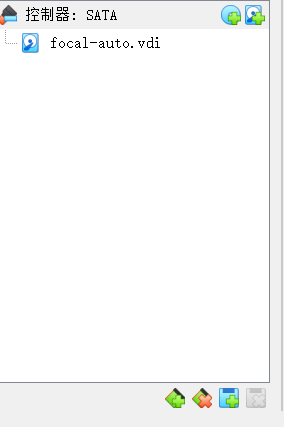
- 在「控制器：SATA」下新建 2 个虚拟光盘，按顺序 先挂载「纯净版 Ubuntu 安装镜像文件」后挂载 focal-init.iso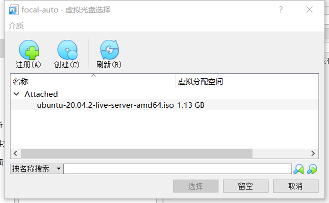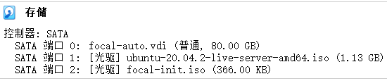
- 启动虚拟机，稍等片刻会看到命令行中出现以下提示信息。此时，需要输入 yes 并按下回车键，剩下的就交给「无人值守安装」程序自动完成系统安装和重启进入系统可用状态了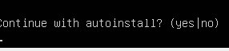
# 无人值守安装iso制作
# 问题
- 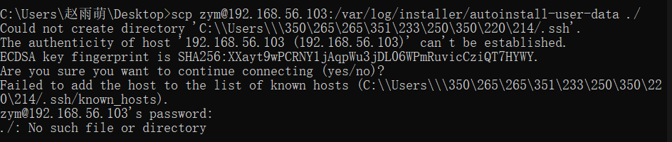
解决：使用git bash
# 参考资料
- (3条消息) windows下git bash中文乱码解决办法_Wells 的专栏-CSDN博客_gitbash中文乱码 https://blog.csdn.net/u013068377/article/details/52168434
- https://blog.csdn.net/qq_43314560/article/details/114262392
- https://jingyan.baidu.com/article/3052f5a1899ec4d7f21f866c.html